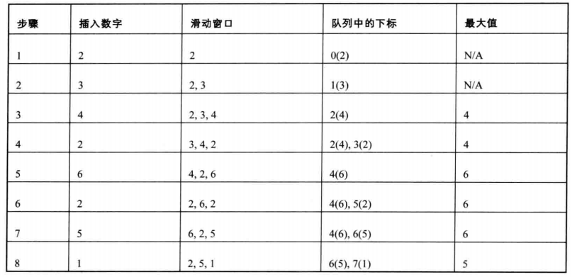

## 题目

给定一个数组 nums，有一个大小为 k 的滑动窗口从数组的最左侧移动到数组的最右侧。你只可以看到在滑动窗口 k 内的数字。滑动窗口每次只向右移动一位。
返回滑动窗口最大值。
```js
输入: nums = [1,3,-1,-3,5,3,6,7], 和 k = 3
输出: [3,3,5,5,6,7] 
解释: 
  滑动窗口的位置                最大值
---------------               -----
[1  3  -1] -3  5  3  6  7       3
 1 [3  -1  -3] 5  3  6  7       3
 1  3 [-1  -3  5] 3  6  7       5
 1  3  -1 [-3  5  3] 6  7       5
 1  3  -1  -3 [5  3  6] 7       6
 1  3  -1  -3  5 [3  6  7]      7
```

## 思路

使用一个双端队列（队列两面都可进出），用于存储处于窗口中的值的下标，保证窗口头部元素永远是窗口最大值
- 1.当前进入的元素下标 - 窗口头部元素的下标 >= k 头部元素移出队列
- 2.如果当前数字大于队列尾，则删除队列尾，直到当前数字小于等于队列尾，或者队列空 （保证窗口中左侧的值均大于当前入队列的值，这样做可以保证当下次循环窗口头部的元素出队后，窗口头部元素仍然为最大值）
- 3.队列元素入队
- 4.第k次遍历后开始向结果中添加最大值



时间复杂度：`O(n)`

空间复杂度：`O(n)`

- 使用优先队列也可以实现，时间复杂度为`O(nlogk)` 

## 代码

```js
    var maxSlidingWindow = function (nums, k) {
      const window = [];
      const result = [];
      for (let i = 0; i < nums.length; i++) {
        if (i - window[0] > k - 1) {
          window.shift();
        }
        let j = window.length - 1;
        while (j >= 0 && nums[window[j]] <= nums[i]) {
          j--;
          window.pop();
        }
        window.push(i);
        if (i >= k - 1) {
          result.push(nums[window[0]]);
        }
      }
      return result;
    };
```

## 考察点

- 队列