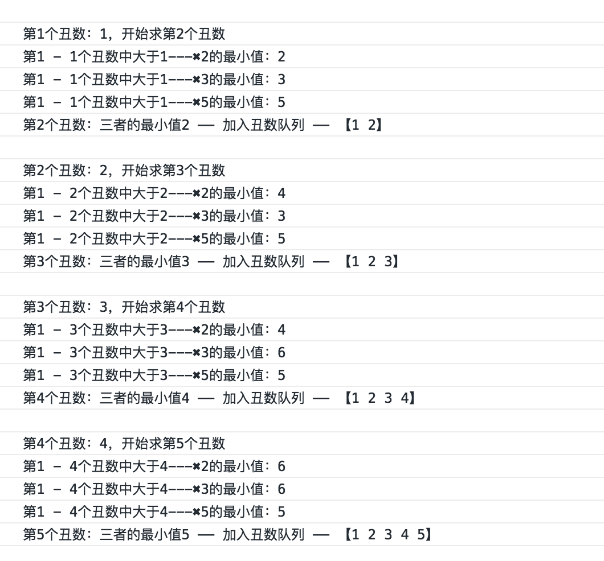

## 题目

把只包含质因子`2、3和5`的数称作丑数（`Ugly Number`）。

例如`6、8`都是丑数，但`14`不是，因为它包含质因子`7`。 

习惯上我们把`1`当做是第一个丑数。求按从小到大的顺序的第`N`个丑数。

## 思路

丑数只能被`2、3、5`整除，说明第`n`个丑数只能是`0 - n-1`中某个丑数✖️`2`、✖️`3`、✖️`5`的结果。

而且，这个数即第`0 - n-1`个丑数✖️`2`、✖️`3`、✖️`5`的结果中比第`n-1`个丑数大的最小值。

按照上面的规律，我们可以依次求出第`0 - n`个丑数。

简单做法：

- 1.每次把第`0 - n-1`个丑数✖️`(2、3、5)`
- 2.分别找到第`0 - n-1`个丑数✖️`2`、✖️`3`、✖️`5`的结果中比第`n-1`个丑数大的最小值。
- 3.比较三个数取最小值加入到丑数队列中

优化：

- 1.前面的数不必每个都乘
- 2.记录下✖️`(2、3、5)`后刚好比当前最大丑数大的这三个值的下标 `i2,i3,i5`
- 3.下次比较从这 `i2,i3,i5` 三个下标开始乘起
- 4.最后取`arr[i2]✖️2、arr[i3]✖️3、arr[i5]✖️5` 的最小值



## 代码

```js
    function GetUglyNumber_Solution(index) {
      if (index <= 0) {
        return 0;
      }
      let arr = [1];
      let i2 = i3 = i5 = 0;
      let cur = 0;
      while (arr.length < index) {
        arr.push(Math.min(arr[i2] * 2, arr[i3] * 3, arr[i5] * 5));
        const current = arr[arr.length - 1];
        while (arr[i2] * 2 <= current) {
          i2++;
        }
        while (arr[i3] * 3 <= current) {
          i3++;
        }
        while (arr[i5] * 5 <= current) {
          i5++;
        }
      }
      return arr[index - 1];
    }
```